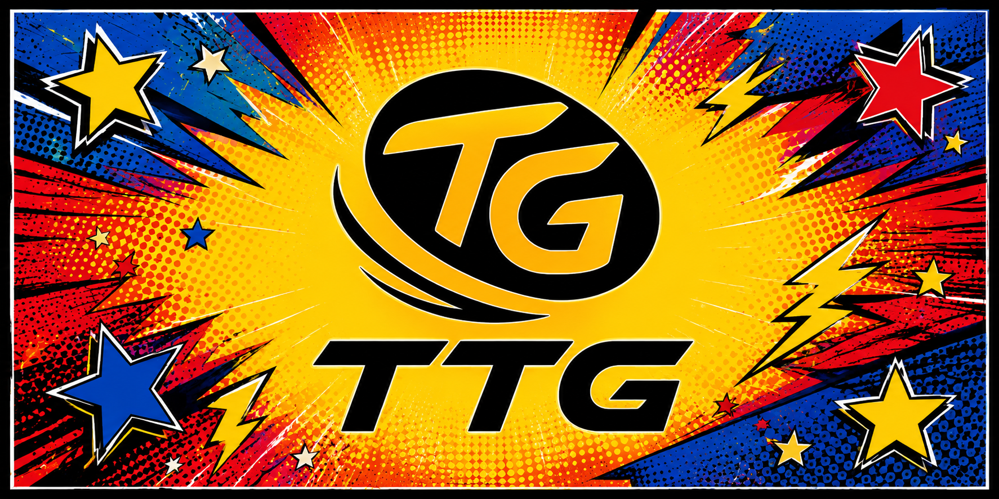
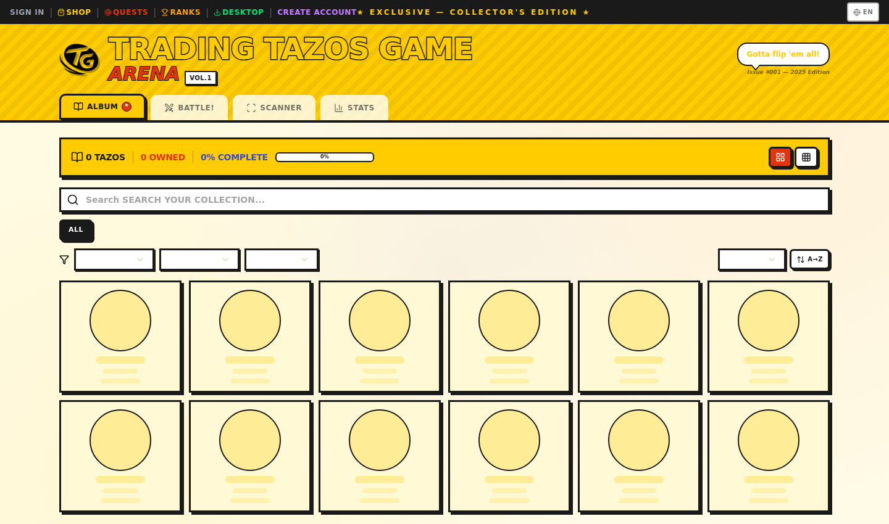
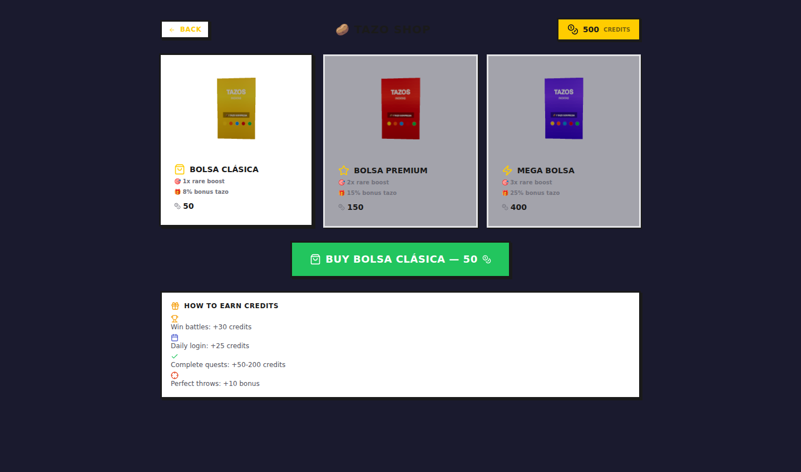
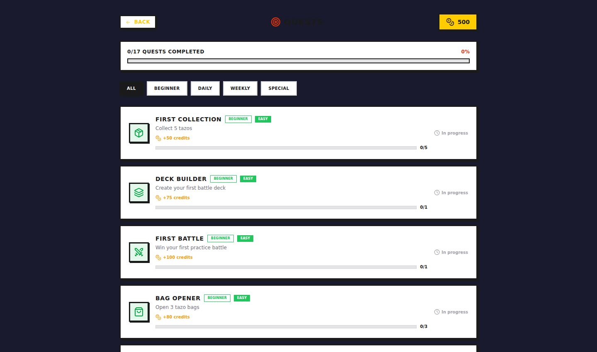
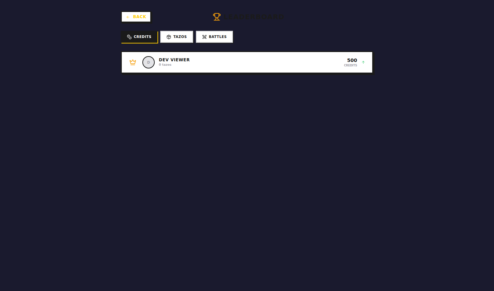
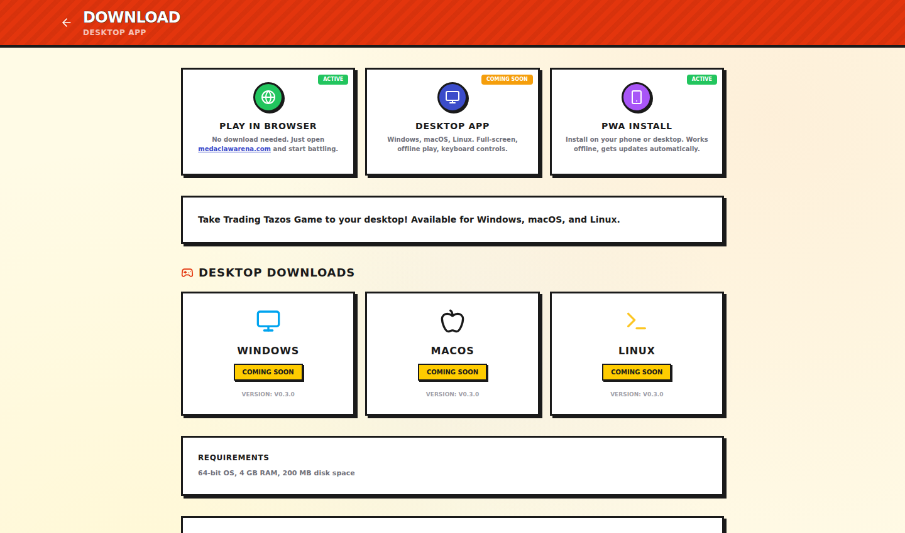
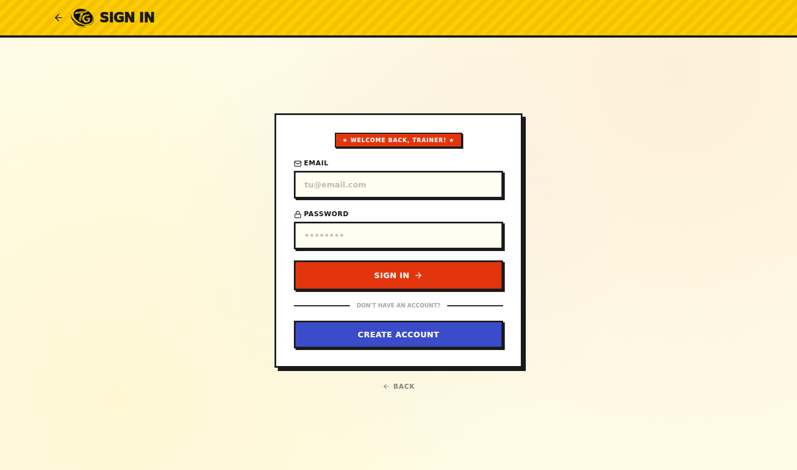
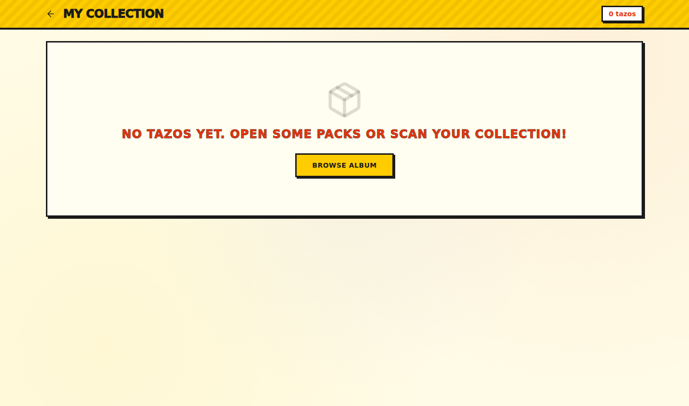
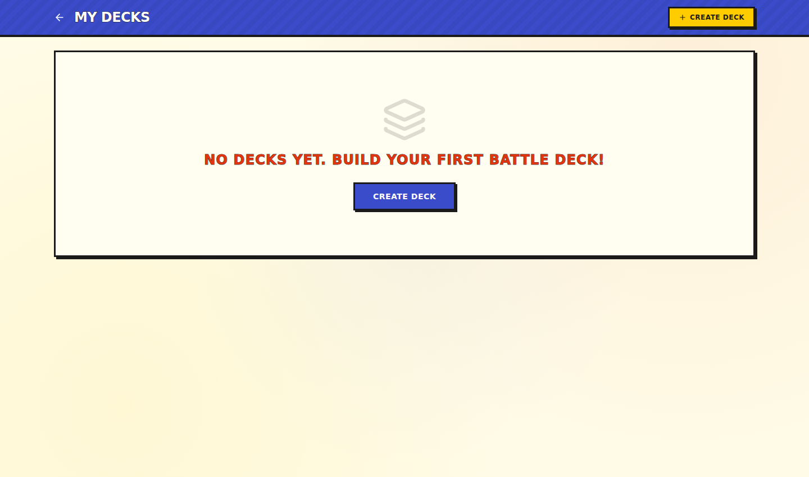
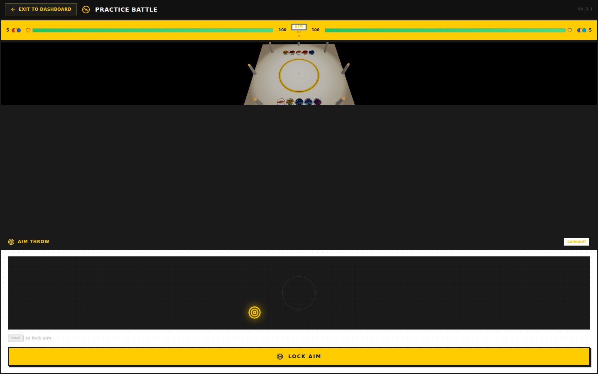

# 🎴 Trading Tazos Game

<div align="center">



### A Skill-Based Physical Tazo Battle Game

[](https://nextjs.org)
[](https://www.typescriptlang.org)
[](https://www.prisma.io)
[](https://tailwindcss.com)
[](https://threejs.org)
[](https://bun.sh)
[](./LICENSE)
[](https://medaclawarena.com)
[](https://medaclawarena.com/manifest.json)
[](./src/lib/i18n/locales/)
[](#changelog)

<br/>

**Aim. Throw. Flip. Capture. Collect.**

Trading Tazos Game is a browser-based physical tazo (pog) battle game. You don't just compare stats — you physically aim, charge power, and throw tazos into a physics-simulated arena. Built with a 90s Nintendo Power magazine aesthetic, 319 real verified Spanish tazos, 9 combat stats, 8 roles, deterministic battle engine, WebSocket multiplayer, 3D bag shop, quests, leaderboards, and achievements.

🌐 **[medaclawarena.com](https://medaclawarena.com)** &nbsp;|&nbsp; 📧 **support@medaclawarena.com** &nbsp;|&nbsp; 📦 **[npm: @trading-tazos-game-cli](https://www.npmjs.com/package/@trading-tazos-game-cli)**

</div>

---

## Screenshots

<div align="center">

| Landing Page | Shop | Quests |
|:---:|:---:|:---:|
|  |  |  |

| Leaderboard | Download | Authentication |
|:---:|:---:|:---:|
|  |  |  |

| Collection | Decks | Battle Arena |
|:---:|:---:|:---:|
|  |  |  |

</div>

---

## What Makes It Different

> Trading Tazos Game is **not** an auto-battle card game.  
> It's a game of **physical tazo throwing** — aim, power, physics, chain rebounds, risk, and field control.

### Core Game Loop

1. **Select** a tazo from your active deck
2. **Aim** horizontally and vertically with timing-based precision
3. **Charge** power — more impact, less accuracy
4. **Throw** into the 2D physics arena
5. **Impact** enemy tazos — flip to capture, push them out, or chain rebounds
6. **Risk it**: miss and your tazo stays vulnerable. Throw too hard and it flies out — the rival places it anywhere.

---

## Features

### Battle System
| Feature | Detail |
|---------|--------|
| Battle Engine | 14-phase deterministic state machine with SeededRNG |
| Combat Stats | Attack, Defense, Resistance, Weight, Stability, Spin, Control, Bounce, Precision |
| Tazo Roles | Attacker, Tank, Technical, Bouncer, Heavy, Light, Balanced, Special |
| Aim Mechanics | 3-phase minigame: horizontal swing → vertical drop → power charge |
| Physics | Canvas 2D collision detection, multi-hit chains, self-flip mechanic |
| Game Modes | Classic (capture all) + Rounds (points scoring) |
| Risk System | Overpower = may fly out of bounds. Miss = vulnerable on field. |
| Event Log | Turn-by-turn Spanish battle descriptions |
| Multiplayer | WebSocket-based PvP matchmaking with JWT auth |

### Collection & Progression
| Feature | Detail |
|---------|--------|
| Tazo Database | 319 real verified Spanish tazos from Pokemon, DBZ, and Digimon |
| Personal Collection | Track owned tazos, favorites, acquisition dates |
| Decks | Build, name, and activate battle decks from your collection |
| Welcome Pack | 10 starter tazos + pre-built deck on registration |
| Stats Panel | Collection completion %, franchise breakdown, rarity distribution |

### Economy & Shop
| Feature | Detail |
|---------|--------|
| 3D Bag Shop | Buy potato chip bags with credits, 3D tear animation, tazo reveal |
| Bag Types | Standard (50cr), Premium (150cr), Mega (400cr) with rare boosts |
| Credit System | Earn via battles (+30), daily login (+25), quests (+50-200) |
| Rarity System | 5 tiers: Common, Uncommon, Rare, Ultra-Rare, Legendary |
| Weighted Drops | Rare boost multiplier per bag type (1x/2x/3x) |

### Quests & Achievements
| Feature | Detail |
|---------|--------|
| Quests | 17 quests across 4 categories: Beginner, Daily, Weekly, Special |
| Achievements | 18 achievements with 4 tiers: Bronze → Silver → Gold → Platinum |
| Leaderboards | Global rankings by credits, tazo count, or battle wins |
| Progress Tracking | Per-quest progress bars, per-achievement unlock tracking |

### Platform
| Feature | Detail |
|---------|--------|
| Web | Full Next.js app at medaclawarena.com |
| PWA | Installable on mobile/desktop with manifest.json and offline support |
| Desktop | Electron app for Windows, macOS, Linux (launcher with splash screen) |
| CLI | npm package `@trading-tazos-game-cli` with 5 commands |
| i18n | 10 languages: EN, ES, PT, DE, FR, IT, JA, KO, ZH, RU |
| SEO | JSON-LD VideoGame schema, sitemap.xml, robots.txt, hreflang alternates |
| Security | CSP + HSTS + X-Frame-Options + httpOnly auth cookies |

---

## Real Collections

| Franchise | Collection | Year | Tazos | Categories |
|-----------|-----------|------|-------|-------------|
| Pokemon | Pokemon Tazos 1 (Matutano) | 2000 | 51 | Tazos, Supertazos Voladores |
| Dragon Ball Z | DBZ Matutano | 1995 | 118 | 7 categories (Tazos, Megatazos, Supertazos Octogonales, Mastertazos, Holo 3D, Caps, Gold) |
| Digimon | Magic Box 2000 | 2000 | 150 | Tazos, Megatazos, Supertazos Voladores |
| **TOTAL** | | | **319** | |

All tazo names, numbers, variants, and categories verified against original Spanish collections. Each tazo has 9 balanced combat stats, a role, and evolutive relationships (pre-evolution, evolution, transformation stage).

---

## Combat Stats

| Stat | Icon | Description |
|------|:----:|-------------|
| Attack | ATK | Impact power — how hard it hits opponents |
| Defense | DEF | Flipping resistance — stay upright on impact |
| Resistance | RES | Difficulty to be flipped or pushed |
| Weight | WGT | Physical mass — affects damage, push force, and stability |
| Stability | STB | Prevents self-flips, knockbacks, and out-of-bounds |
| Spin | SPN | Maintains rotation and energy after landing |
| Control | CTR | Reduces throw deviation for better accuracy |
| Bounce | BNC | Improves rebounds and chained multi-hits |
| Precision | PRC | Improves aim and reduces horizontal/vertical error |

### Throw Risk/Reward

| Power Level | Circle Size | Impact | Accuracy | Risk |
|:-----------:|:-----------:|:------:|:--------:|------|
| Low | Large | Weak | High | Safe — won't fly out |
| Medium | Medium | Balanced | Normal | Standard risk |
| High | Small | Strong | Low | May scatter unpredictably |
| Maximum | Tiny | Devastating | Very Low | High chance of self-flip or out-of-bounds |

---

## Tech Stack

| Layer | Technology |
|-------|-----------|
| Framework | Next.js 16.1 (App Router, Server Components, Turbopack) |
| Language | TypeScript 5.x (strict mode, 0 type errors) |
| Styling | Tailwind CSS 4 + custom magazine theme system (THEME.md) |
| UI Components | shadcn/ui (Radix primitives) + Lucide React icons |
| 3D Rendering | Three.js + @react-three/fiber + @react-three/drei |
| Battle Graphics | HTML5 Canvas 2D with deterministic physics |
| ORM | Prisma 6.x (12 models, automated migrations) |
| Database | SQLite (zero-config, portable, 360KB with 319 tazos) |
| Auth | JWT (jsonwebtoken) + bcryptjs (12 rounds) + httpOnly cookies |
| Multiplayer | WebSocket (ws@7.5.10) with JWT auth and room system |
| Desktop | Electron with splash screen, system tray, single-instance lock |
| Runtime | Bun (build) + Node.js 22 (production) |
| Deploy | PM2 + Caddy (HTTPS, gzip, CSP, HSTS, WebSocket proxy) |
| Monitoring | Plausible Analytics (self-hosted) |
| Design System | THEME.md — 90s magazine aesthetic with documented tokens |

---

## Project Structure

```
Trading-Tazos-Game/
├── prisma/
│   ├── schema.prisma              # 12 models: User, Franchise, Collection, Tazo,
│   │                              #   UserTazo, Deck, DeckTazo, BattleRecord,
│   │                              #   BagPurchase, CreditTransaction, Quest,
│   │                              #   UserQuest, Achievement, UserAchievement
│   ├── seed.ts                    # 319 real verified tazos
│   └── seed-quests.ts             # 17 quests + 18 achievements
├── src/
│   ├── middleware.ts              # Auth route protection (collection, decks, quests, shop)
│   ├── app/
│   │   ├── page.tsx               # Landing (magazine masthead + franchise tabs)
│   │   ├── layout.tsx             # Root layout (SEO, PWA, JSON-LD, i18n)
│   │   ├── collection/            # Personal tazo collection
│   │   ├── decks/                 # Deck builder
│   │   ├── shop/                  # 3D bag shop (select → open → reveal)
│   │   ├── quests/                # Quest system (daily, weekly, special)
│   │   ├── leaderboard/           # Global rankings (credits, tazos, battles)
│   │   ├── download/              # Desktop app downloads
│   │   ├── login/ + register/     # Auth pages
│   │   └── api/
│   │       ├── auth/              # login, register, me, logout
│   │       ├── bags/              # buy, open
│   │       ├── credits/           # balance, earn
│   │       ├── quests/            # list, claim
│   │       ├── leaderboard/       # global rankings
│   │       ├── achievements/      # list + progress
│   │       ├── battle/            # Battle simulation
│   │       ├── decks/             # CRUD + activate
│   │       ├── collection/        # CRUD user tazos
│   │       ├── tazos/             # Public catalog + detail
│   │       ├── franchises/        # Franchise metadata
│   │       ├── stats/             # Global stats
│   │       ├── multiplayer/       # WebSocket status
│   │       └── scanner/           # Photo upload + crop + detect
│   ├── components/
│   │   └── game/
│   │       ├── battle/            # arena-canvas, launch-control, event-log, result-panel
│   │       ├── 3d/                # tazo-disc-3d, chip-bag-3d, scene-3d
│   │       ├── battle-view.tsx    # Full battle experience (practice + PvP)
│   │       ├── pvp-battle-panel.tsx  # WebSocket multiplayer battle
│   │       ├── album-view.tsx     # Filterable tazo grid
│   │       ├── tazo-card.tsx      # Individual tazo display
│   │       ├── tazo-detail-modal.tsx  # Full detail with 9 stats
│   │       ├── stats-panel.tsx    # Collection analytics
│   │       └── scanner-view.tsx   # Photo upload + tazo detection
│   └── lib/
│       ├── battle/                # 14-phase deterministic engine (4 files, 1355 lines)
│       │   ├── battle-engine.ts   # State machine
│       │   ├── battle-rules.ts    # Physics, collisions, impacts
│       │   ├── battle-scoring.ts  # Points, captures, penalties
│       │   └── battle-types.ts    # TypeScript interfaces
│       ├── i18n/                  # 10-language system with auto-detection
│       ├── auth.ts                # JWT + bcrypt helpers + cookie extraction
│       ├── auth-context.tsx        # AuthProvider + useAuth React hook
│       ├── multiplayer.ts         # WebSocket client with auto-reconnect
│       └── db.ts                  # Prisma client singleton
├── electron/
│   └── main.js                    # Electron main process (splash, tray, single-instance)
├── server/
│   └── ws-server.js               # WebSocket server (native crypto JWT, zero ext deps)
├── public/
│   ├── logo/                      # 6 official logo variants + 4 social banners
│   ├── tazos/                     # Generated SVG tazo disc images
│   ├── manifest.json              # PWA manifest
│   ├── robots.txt                 # SEO + AI crawler rules
│   └── sitemap.xml                # 7 URLs with hreflang alternates
├── THEME.md                       # Design system spec (colors, typography, components)
├── deploy.sh                      # Build → rsync → distDir sync → PM2 restart → verify
├── ecosystem.config.cjs           # PM2 process configuration
└── package.json                   # Bun + Node scripts + Electron build config
```

---

## Getting Started

### Prerequisites
- [Bun](https://bun.sh) 1.x or Node.js 22+
- SQLite (included — zero external DB setup)

### Install & Run

```bash
git clone https://github.com/smouj/Trading-Tazos-Game.git
cd Trading-Tazos-Game

bun install                              # Dependencies
cp .env.example .env                     # Configure JWT_SECRET
bunx prisma db push                      # Create database
bun run seed                             # 319 tazos + 17 quests + 18 achievements

bun run dev                              # http://localhost:3000
```

### Environment Variables

```bash
DATABASE_URL="file:./prisma/dev.db"
JWT_SECRET="generate-a-random-secret-here"
NEXT_PUBLIC_SITE_NAME="Trading Tazos Game"
NEXT_PUBLIC_BASE_URL=http://localhost:3000
```

---

## Deploy

### Production (medaclawarena.com)

```bash
./deploy.sh
```

**What it does**: Builds the Next.js standalone output, syncs to VPS via rsync, fixes distDir mismatch, sets DATABASE_URL to absolute path, excludes DB files from overwrite, restarts PM2, and verifies all pages return 200.

### Architecture

```
medaclawarena.com
  └── Caddy (TLS, gzip, CSP, HSTS, /ws* → WebSocket)
      ├── PM2 `ttg`        (fork, :3000)  — Next.js server
      └── PM2 `ttg-ws`     (fork, :3001)  — WebSocket server
```

### PM2

```bash
ssh rpgvps "pm2 status"                        # All processes
ssh rpgvps "pm2 logs ttg --lines 50"           # App logs
ssh rpgvps "pm2 restart ttg ttg-ws"            # Restart both
```

---

## i18n — 10 Languages

Detects language from `navigator.languages` / `Accept-Language` header and persists in `localStorage`.

| Code | Language | Coverage |
|:----:|----------|:--------:|
| EN | English | 100% |
| ES | Spanish | 100% |
| PT | Portuguese | 100% |
| DE | German | 100% |
| FR | French | 100% |
| IT | Italian | 100% |
| JA | Japanese | 100% |
| KO | Korean | 100% |
| ZH | Chinese | 100% |
| RU | Russian | 100% |

---

## Design System

The game uses a **90s Nintendo Power / Pokemon Magazine** aesthetic specified in [`THEME.md`](./THEME.md). Every visual element follows a documented design system with:

- 12-token color palette (FFCC00 yellow, E3350D red, 3B4CCA blue)
- 7-level typography hierarchy (all `font-black` + `uppercase`)
- 4-level border + shadow system on `#1a1a1a`
- 30+ documented CSS utility classes (mag-card, mag-btn, mag-stroke, mag-bg)
- Component anatomy diagrams for cards, buttons, page shells
- 15 anti-pattern rules (no emojis, no grays, no rounded-xl, no Tailwind shadows)

---

## npm CLI

```bash
npm install -g @trading-tazos-game-cli
ttg search pikachu          # Search tazo database
ttg stats                   # Global stats
ttg top --sort credits      # Leaderboard
ttg battle                  # Simulate a battle
ttg info                    # Version + server info
```

---

## Disclaimer

This is a fan-made tribute project. Pokemon, Digimon, and Dragon Ball Z are trademarks of their respective owners. No copyrighted assets are included — all tazo images are original generated SVGs based on verified Spanish physical collections.

---

## Changelog

### v0.3.0 — 3D Shop + PWA + Quests + Leaderboards (Jun 2026)
- 3D chip bag shop with tear animation and rarity drops
- Credit economy (battles +30cr, daily +25cr, quests +50-200cr)
- 17 quests across beginner, daily, weekly, and special categories
- 18 achievements with 4-tier progression (bronze → platinum)
- Global leaderboards by credits, tazos, and battles
- Middleware with httpOnly auth cookies and route protection
- PWA manifest, installable, offline-ready
- Electron desktop launcher with animated splash and system tray
- SEO overhaul: JSON-LD VideoGame, sitemap.xml, robots.txt, hreflang
- Design system spec (THEME.md) with documented tokens and anti-patterns
- Custom favicon (3 sizes) and 6 logo variants
- WebSocket multiplayer with JWT auth and room system
- npm CLI package `@trading-tazos-game-cli` (5 commands)
- Source Available License v1.0

### v0.2.3 — Auth & Deck System
- JWT authentication with bcrypt password hashing
- Personal tazo collection per user with favorites
- Deck builder with active deck switching
- Battle loads user's active deck for combat
- Welcome pack (10 tazos + starter deck) on registration
- Multiplayer WebSocket server with native crypto JWT

### v0.2.0 — Battle Engine v2
- 9-stat combat system (attack, defense, resistance, weight, stability, spin, control, bounce, precision)
- 8 tazo roles (attacker, tank, technical, bouncer, heavy, light, balanced, special)
- Self-flip mechanic (high power + bad accuracy = you flip yourself)
- Combo bonus (2+ captures in one throw = extra points)
- Rounds game mode with points scoring
- Canonical names for all 319 tazos (Spanish + Japanese context corrections)
- i18n system with 10 languages and auto-detection

### v0.1.0 — Initial Launch
- 319 real verified Spanish tazos across 3 franchises
- Canvas 2D battle arena with physics simulation
- 14-phase deterministic battle engine with SeededRNG
- Magazine-themed UI (Nintendo Power 90s aesthetic)
- Filterable album with franchise, collection, category, and rarity filters
- Photo scanner for physical tazo detection
- 3D tazo disc rendering with Three.js / R3F

---

<div align="center">

**Made by [@smouj](https://github.com/smouj)** &nbsp;|&nbsp; **[medaclawarena.com](https://medaclawarena.com)**

*Physical tazos. Real physics. Pure nostalgia.*

</div>
